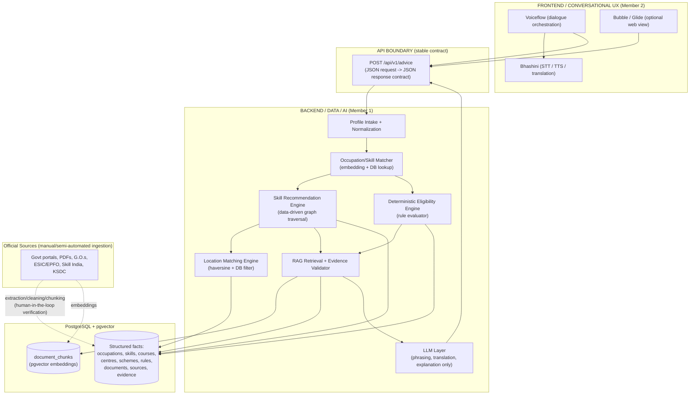
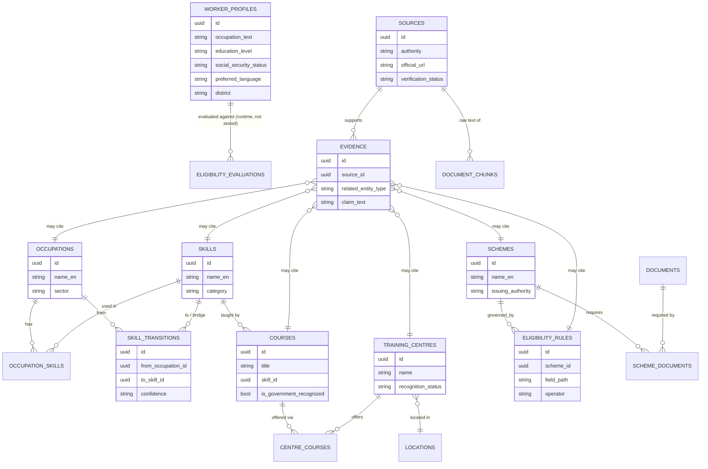

# AI Skill Navigator for Informal Workers — Karnataka
## Data & Knowledge Architecture Specification (Pre-Hackathon Deliverable)

Status: **Architecture and schema only. No application, frontend, automation, or seed data has been built.**
This document is the complete blueprint to be implemented during the 24-hour sprint.

---

## Table of Contents

- [A. Executive Architecture Summary](#a-executive-architecture-summary)
- [B. System Architecture Diagram](#b-system-architecture-diagram)
- [C. Entity/Relationship Diagram](#c-entityrelationship-diagram)
- [D. Complete Data Dictionary](#d-complete-data-dictionary)
- [E. Source/Provenance Architecture](#e-sourceprovenance-architecture)
- [F. RAG Architecture](#f-rag-architecture)
- [G. Eligibility Architecture](#g-eligibility-architecture)
- [H. Skill Recommendation Architecture](#h-skill-recommendation-architecture)
- [I. Location Matching Architecture](#i-location-matching-architecture)
- [J. Canonical API/JSON Contract](#j-canonical-apijson-contract)
- [K. Dataset CSV Templates](#k-dataset-csv-templates)
- [L. Repository Structure](#l-repository-structure)
- [M. Two-Person Responsibility Matrix](#m-two-person-responsibility-matrix)
- [N. Five Golden Test Cases](#n-five-golden-test-cases)
- [O. Failure-Handling Strategy](#o-failure-handling-strategy)
- [P. Pre-Hackathon vs Hackathon-Day Plan](#p-pre-hackathon-vs-hackathon-day-plan)
- [Q. Risks and Architectural Decisions](#q-risks-and-architectural-decisions)

---

## A. Executive Architecture Summary

The system answers three questions for an informal worker in Karnataka — *what skill should I learn, where can I learn it, who pays and what do I do next* — by combining three separate layers that are **never allowed to blend into one another**:

1. **A structured factual layer (PostgreSQL)** — occupations, skills, courses, training centres, schemes, eligibility rules, documents. Every row that states a government fact carries a mandatory link to a verified source. This layer is the *only* place eligibility decisions, distances, and skill-gap computations happen.
2. **A retrieval layer (pgvector)** — raw text chunks from official PDFs/portals, used only to ground natural-language explanation and to surface *candidate* facts for a human to verify and promote into the structured layer. It never drives a decision by itself.
3. **A language layer (LLM)** — Gemini/OpenAI-class model. Its job is translation, phrasing, empathy, and explaining *already-computed* results in Kannada/Hindi/English. It is explicitly forbidden from inventing schemes, centres, eligibility outcomes, or URLs.

The core architectural principle driving every section below:

> **If a government fact is not in the database with a verified source, the system says "uncertain" or "REQUIRES OFFICIAL SOURCE VERIFICATION." It never guesses, and the LLM is never treated as a source of truth for government facts.**

This document defines schema, provenance rules, RAG flow, a deterministic eligibility engine, a data-driven skill-transition model, location-matching logic, and the stable JSON contract the frontend will consume — without populating any real government data yet.

---

## B. System Architecture Diagram



Key point: the LLM box only receives *already-retrieved, already-computed* material and returns phrasing. It has no independent path to the frontend and no write path to the database.

---

## C. Entity/Relationship Diagram



**Conceptual traversal (the path a request actually takes):**

```
worker_profile
  → matched occupation (occupations)
    → current skills (occupation_skills)
      → candidate target skills (skill_transitions, data-driven)
        → skill gap (computed: target requirements − current skills)
          → courses teaching target skill (courses)
            → centres offering course, filtered by location (training_centres + centre_courses)
    → applicable schemes (schemes, filtered by sector/location/social-security status)
      → eligibility_rules evaluated against worker_profile → eligible/not_eligible/uncertain
        → required documents (scheme_documents → documents)
  → every factual node above carries source_id → sources/evidence → shown to user as citations
```

---

## D. Complete Data Dictionary

Provenance legend: **U** = user-provided, **S** = official source-derived, **C** = computed/derived, **Y** = system-derived (IDs, timestamps).

### 1. `worker_profiles`
*Ephemeral per-session input. Not government data — this is the only entity primarily in category U.*

| Field | Type | Req | Description | Example | Provenance |
|---|---|---|---|---|---|
| id | uuid | Y | Primary key | `9f1c...` | Y |
| session_id | string | Y | Conversation/session identifier | `vf-2f9a...` | Y |
| occupation_text | string | Y | Free-text occupation as stated by worker | "delivery boy on bike" | U |
| occupation_id | uuid (fk→occupations) | N | Resolved occupation after matching | | C |
| district | string | Y | Karnataka district | "Bengaluru Urban" | U |
| taluk_or_city | string | N | Finer-grained location | "Whitefield" | U |
| pincode | string | N | Postal code, used for geocoding | "560066" | U |
| education_level | enum | Y | Below 8th / 8th-10th / 10th pass / 12th pass / ITI / Diploma / Graduate / None | "10th pass" | U |
| social_security_status | enum | Y | none / e-Shram / ESIC / EPFO / state-welfare-board / unknown | "none" | U |
| age | integer | N | Needed by many age-bound eligibility rules | 27 | U |
| gender | enum | N | Some schemes are gender-specific | "female" | U |
| preferred_language | enum | Y | kn / hi / en | "kn" | U |
| career_goal_text | string | N | Optional free-text aspiration | "want to become electrician" | U |
| consent_flag | bool | Y | Data-use consent | true | U |
| created_at | timestamp | Y | | 2026-09-05T10:00:00Z | Y |

### 2. `occupations`

| Field | Type | Req | Description | Example | Provenance |
|---|---|---|---|---|---|
| id | uuid | Y | PK | | Y |
| name_en / name_hi / name_kn | string | Y | Occupation name, trilingual | "Delivery Rider" | S (curated) |
| sector | string | Y | Broad sector grouping | "Gig Economy / Logistics" | S (curated) |
| nco_code | string | N | National Classification of Occupations code, if mapped | "REQUIRES OFFICIAL SOURCE VERIFICATION" | S |
| is_informal_sector | bool | Y | | true | S (curated) |
| description | text | N | | | S/curated |
| source_id | uuid (fk→sources) | N | Only if classification is drawn from an official taxonomy | | S |

### 3. `skills`

| Field | Type | Req | Description | Example | Provenance |
|---|---|---|---|---|---|
| id | uuid | Y | PK | | Y |
| name_en / name_hi / name_kn | string | Y | | "Two-Wheeler EV Servicing" | S (curated) |
| category | enum | Y | technical / digital / safety / soft-skill / certification | "technical" | S (curated) |
| skill_level | enum | Y | beginner / intermediate / advanced | "beginner" | S (curated) |
| is_certifiable | bool | Y | Whether a recognized certificate exists for this skill | true | S |
| certifying_body | string | N | e.g. Sector Skill Council name | "REQUIRES OFFICIAL SOURCE VERIFICATION" | S |
| description | text | N | | | S/curated |
| source_id | uuid (fk→sources) | N | | | S |

### 4. `occupation_skills` (junction: skills currently used in an occupation)

| Field | Type | Req | Description | Example | Provenance |
|---|---|---|---|---|---|
| id | uuid | Y | PK | | Y |
| occupation_id | uuid (fk) | Y | | | Y |
| skill_id | uuid (fk) | Y | | | Y |
| relevance | enum | Y | core / supporting | "core" | S (curated) |
| curation_status | enum | Y | verified / expert-heuristic / needs-review | "expert-heuristic" | S |
| source_id | uuid (fk→sources) | N | If drawn from an official qualification pack | | S |

### 5. `skill_transitions` (data-driven candidate career moves)

| Field | Type | Req | Description | Example | Provenance |
|---|---|---|---|---|---|
| id | uuid | Y | PK | | Y |
| from_occupation_id | uuid (fk) | Y | | | Y |
| to_skill_id | uuid (fk→skills) | Y | Target skill | | Y |
| bridge_skill_ids | uuid[] | N | Prerequisite skills to acquire first | | S (curated) |
| rationale | text | Y | Why this transition is realistic | "Delivery riders already know local roads + basic vehicle handling, natural bridge to EV servicing" | S (curated) |
| confidence | enum | Y | data-driven / expert-curated / heuristic | "expert-curated" | S |
| market_demand_note | text | N | Optional labour-market signal | "REQUIRES OFFICIAL SOURCE VERIFICATION" | S |
| source_id | uuid (fk→sources) | N | | | S |

### 6. `courses`

| Field | Type | Req | Description | Example | Provenance |
|---|---|---|---|---|---|
| id | uuid | Y | PK | | Y |
| title | string | Y | | "Two-Wheeler EV Repair — Basic" | S |
| skill_id | uuid (fk) | Y | Target skill taught | | S |
| level | enum | Y | | "beginner" | S |
| duration_value / duration_unit | int / enum(hours,days,weeks) | Y | | 6 / weeks | S |
| mode | enum | Y | online / offline / hybrid | "offline" | S |
| languages_supported | string[] | Y | | ["kn","en"] | S |
| certifying_body | string | N | | "REQUIRES OFFICIAL SOURCE VERIFICATION" | S |
| is_government_recognized | bool | Y | | true | S |
| fee_type | enum | Y | free / subsidized / paid | "free" | S |
| fee_amount_inr | numeric | N | | 0 | S |
| source_id | uuid (fk→sources) | Y | Mandatory — no course without a source | | S |
| last_verified | date | Y | | 2026-08-01 | S |

### 7. `training_centres`

| Field | Type | Req | Description | Example | Provenance |
|---|---|---|---|---|---|
| id | uuid | Y | PK | | Y |
| name | string | Y | | "Govt ITI, XYZ" | S |
| type | enum | Y | govt-ITI / PMKVY-partner / KSDC-centre / NGO-empanelled / other | "govt-ITI" | S |
| district | string | Y | fk-ish to `locations.district` | "Mysuru" | S |
| taluk | string | N | | | S |
| address | text | Y | | | S |
| latitude / longitude | numeric | N | Null if not yet geocoded | | S/C |
| recognition_status | enum | Y | govt-recognized / empanelled / unverified | "govt-recognized" | S |
| contact_phone / contact_email | string | N | | | S |
| official_source_id | uuid (fk→sources) | Y | Mandatory | | S |
| last_verified | date | Y | | | S |

### 8. `centre_courses` (junction, and the most volatile table — seats/batches change often)

| Field | Type | Req | Description | Example | Provenance |
|---|---|---|---|---|---|
| id | uuid | Y | PK | | Y |
| centre_id | uuid (fk) | Y | | | Y |
| course_id | uuid (fk) | Y | | | Y |
| batch_schedule_note | text | N | | "New batch starts monthly" | S |
| fee_override_inr | numeric | N | If differs from course default | | S |
| source_id | uuid (fk→sources) | Y | | | S |
| last_verified | date | Y | | | S |
| freshness_flag | enum | Y | current / stale-recheck-needed | "current" | C (computed from last_verified age) |

### 9. `schemes`

| Field | Type | Req | Description | Example | Provenance |
|---|---|---|---|---|---|
| id | uuid | Y | PK | | Y |
| name_en / name_hi / name_kn | string | Y | | "REQUIRES OFFICIAL SOURCE VERIFICATION" | S |
| issuing_authority | string | Y | | "ESIC / Dept of Labour Karnataka / etc." | S |
| scheme_type | enum | Y | skilling / financial-support / insurance / social-security | | S |
| benefit_summary | text | Y | Plain description of benefit, sourced verbatim/paraphrased from official text | | S |
| official_url | string (url) | Y | Must be a real, verified URL — never invented | | S |
| status | enum | Y | active / expired / unknown | "unknown" until verified | S |
| source_id | uuid (fk→sources) | Y | Mandatory | | S |
| last_verified | date | Y | | | S |

### 10. `eligibility_rules` (atomic, machine-evaluable conditions)

| Field | Type | Req | Description | Example | Provenance |
|---|---|---|---|---|---|
| id | uuid | Y | PK | | Y |
| scheme_id | uuid (fk) | Y | | | Y |
| rule_group_id | int | Y | Groups rules combined by `logic_connector` | 1 | S |
| field_path | string | Y | Dot-path into worker_profiles | "worker_profiles.age" | S |
| operator | enum | Y | eq / neq / in / not_in / gte / lte / gt / lt / exists / not_exists | "gte" | S |
| value | jsonb | Y | Comparison value(s) | 18 | S |
| logic_connector | enum | Y | AND / OR (to next rule in same group) | "AND" | S |
| mandatory | bool | Y | If true and unmet → not_eligible; if unknown → uncertain | true | S |
| human_readable_condition | text | Y | For explanation | "Worker must be 18 years or older" | S |
| rule_status | enum | Y | verified / draft / needs-review | "draft" | S |
| source_id | uuid (fk→sources) | Y | Mandatory | | S |
| last_verified | date | Y | | | S |

### 11. `documents`

| Field | Type | Req | Description | Example | Provenance |
|---|---|---|---|---|---|
| id | uuid | Y | PK | | Y |
| name | string | Y | | "Aadhaar Card" | S |
| description | text | N | | | S |
| issuing_authority | string | N | | "UIDAI" | S |
| how_to_obtain | text | N | | "REQUIRES OFFICIAL SOURCE VERIFICATION" | S |
| source_id | uuid (fk→sources) | N | | | S |

### 12. `scheme_documents` (junction)

| Field | Type | Req | Description | Example | Provenance |
|---|---|---|---|---|---|
| id | uuid | Y | PK | | Y |
| scheme_id | uuid (fk) | Y | | | Y |
| document_id | uuid (fk) | Y | | | Y |
| mandatory | bool | Y | | true | S |
| source_id | uuid (fk→sources) | N | | | S |

### 13. `sources` (the provenance root — see Section E)

| Field | Type | Req | Description | Example | Provenance |
|---|---|---|---|---|---|
| id | uuid | Y | PK | | Y |
| authority | string | Y | Issuing government body | "ESIC" | S |
| title | string | Y | Document/portal title | | S |
| official_url | string (url) | Y | Never invented; must be visited and confirmed by a human | | S |
| source_type | enum | Y | act / notification / gazette / portal-page / pdf-guideline / helpline-confirmed | | S |
| publication_date | date | N | | | S |
| retrieved_date | date | Y | When the team accessed it | | Y |
| last_verified_date | date | Y | | | Y |
| verification_status | enum | Y | verified / pending-review / broken-link / superseded | "pending-review" | S/curated |
| notes | text | N | | | curated |

### 14. `evidence` (fact ↔ source binding)

| Field | Type | Req | Description | Example | Provenance |
|---|---|---|---|---|---|
| id | uuid | Y | PK | | Y |
| source_id | uuid (fk→sources) | Y | | | Y |
| related_entity_type | enum | Y | occupation / skill / course / training_centre / scheme / eligibility_rule / document | | Y |
| related_entity_id | uuid | Y | | | Y |
| claim_text | text | Y | The specific factual claim this evidence supports | "This centre is PMKVY-empanelled" | S |
| excerpt_text | text | Y | Verbatim excerpt from the source | | S |
| page_or_section | string | N | | "Section 4.2" | S |
| verification_status | enum | Y | verified / candidate-unverified | "candidate-unverified" | S |

### 15. `locations` (reference/master data — needed for distance computation)

| Field | Type | Req | Description | Example | Provenance |
|---|---|---|---|---|---|
| id | uuid | Y | PK | | Y |
| district | string | Y | Karnataka district name | "Ballari" | S (admin boundaries) |
| taluk | string | N | | | S |
| centroid_lat / centroid_lng | numeric | N | Approximate centroid, used only as a fallback when a worker gives district but no pincode | | S (mark approximate) |
| source_id | uuid (fk→sources) | N | Census/Survey of India or equivalent | | S |

### 16. `document_chunks` (RAG vector store — see Section F; distinct from `evidence`)

| Field | Type | Req | Description | Example | Provenance |
|---|---|---|---|---|---|
| id | uuid | Y | PK | | Y |
| source_id | uuid (fk→sources) | Y | | | Y |
| chunk_text | text | Y | Cleaned chunk of source document | | S |
| embedding | vector | Y | pgvector embedding | | C |
| metadata | jsonb | Y | section heading, page number, related_entity hints | | S/C |
| promoted_to_evidence | bool | Y | Whether a human has reviewed this chunk and created a matching `evidence` row | false | curated |

---

## E. Source/Provenance Architecture

**Rule zero:** No row in `occupations` (beyond generic labels), `courses`, `training_centres`, `schemes`, `eligibility_rules`, or `documents` that states a government-specific fact may be inserted without a non-null `source_id`, and that source must reach `verification_status = verified` before the fact is ever surfaced to an end user as a stated fact.

### Provenance object shape (`sources` + `evidence` together)

```
source_id            -> which official document/portal
authority             -> issuing government body (ESIC, KSDC, Dept of Labour, etc.)
title                 -> exact document/page title
official_url          -> real URL only; never invented; if unknown, leave null and mark
                         the dependent fact as "REQUIRES OFFICIAL SOURCE VERIFICATION"
source_type           -> act / notification / gazette / portal-page / pdf-guideline / helpline-confirmed
publication_date      -> if stated on the source
last_verified_date    -> date a human last opened the URL and confirmed it still says this
related_entity        -> (type, id) of the DB row this source backs
claim_text            -> the exact factual claim being made
excerpt_text          -> verbatim quoted text supporting the claim (audit trail)
verification_status   -> verified | pending-review | broken-link | superseded
```

### Enforcement rules

1. **Insert-time constraint:** application-layer validation (and ideally a DB check/trigger) rejects any insert into `schemes`, `eligibility_rules`, `training_centres`, or `courses` where `source_id IS NULL`.
2. **Serve-time constraint:** the API layer filters out any fact whose linked source has `verification_status != verified` before it reaches the response contract — such facts are either omitted or replaced with `"REQUIRES OFFICIAL SOURCE VERIFICATION"`.
3. **No orphan claims:** every `evidence.claim_text` must map 1:1 to a specific field or row the system actually displays. Evidence is not decorative — it's the citation for exactly what's shown.
4. **Two-source rule (target, not hard gate for hackathon):** where feasible, high-stakes claims (benefit amount, eligibility age/income threshold) are corroborated by a second independent source before `verified` is set. Where only one source exists, `rule_status`/`verification_status` stays `needs-review` and the eligibility engine treats it as **uncertain**, not false.
5. **Staleness rule:** any source with `last_verified_date` older than a configurable threshold (e.g. 90 days) is auto-flagged `stale-recheck-needed`; dependent facts are still shown but the response includes a `warnings` entry (see Section J) noting the info may be outdated.
6. **LLM boundary:** the LLM is never given write access to `sources`, `evidence`, or any fact table. It only reads validated output. This is enforced architecturally (LLM calls go through a read-only service layer), not by prompting alone.

---

## F. RAG Architecture

RAG is used **only** to (a) help draft candidate structured rows for human review, and (b) ground explanatory language in verbatim text. It never makes the eligible/not-eligible decision and never invents a centre or scheme.

```
Official source (gov portal page / PDF / gazette notification)
        │  (manual download or scrape, hackathon-day, human-selected sources only)
        ▼
Extraction        — PDF text extraction (e.g. pdfplumber/unstructured) or HTML scrape; OCR fallback for scanned PDFs
        ▼
Cleaning          — strip headers/footers/nav boilerplate, normalize whitespace, keep section headings intact
        ▼
Chunking          — section-aware chunks, ~300–800 tokens, never split mid-clause of an eligibility condition
        ▼
Metadata tagging  — source_id, authority, publication_date, retrieved_date, page/section, candidate related_entity hints
        ▼
Embeddings        — embedding model (Gemini/OpenAI embeddings API)
        ▼
pgvector storage  — document_chunks table (chunk_text, embedding, metadata jsonb, promoted_to_evidence=false)
        ▼
Retrieval         — top-k cosine similarity at query time, filtered by metadata (e.g. district, scheme candidate)
        ▼
Evidence validation — a retrieved chunk may only be used to state a fact to the end user if a human has
                       already promoted it into a verified `evidence` row citing a `sources` entry.
                       An unpromoted chunk can only surface internally as "candidate — needs curator review."
        ▼
LLM response      — LLM is given (a) the structured facts already computed/matched, and (b) the *validated*
                     evidence excerpts only. System prompt explicitly forbids adding any fact not present in
                     the supplied context. If retrieval + evidence yields nothing usable, LLM must say
                     "uncertain" / "REQUIRES OFFICIAL SOURCE VERIFICATION" rather than fill the gap.
```

### Structured DB facts vs. vectorized content

| Goes in relational tables (drives logic/decisions) | Goes in `document_chunks` only (grounds explanation) |
|---|---|
| Eligibility conditions (age, income, occupation, social-security status) | Full scheme guideline narrative / preamble |
| Benefit amount / type | FAQ prose, procedural walkthroughs |
| Required documents list | Background/context paragraphs |
| Centre address, coordinates, recognition status | Long-form policy justification text |
| Course–skill mapping, duration, fee | Contact-page boilerplate |

**Rule:** nothing that drives a yes/no/amount decision may live *only* as a vector chunk. It must first be extracted into a structured, sourced row.

---

## G. Eligibility Architecture

Eligibility is **never** decided by the LLM. It is a deterministic rule evaluator reading `eligibility_rules`.

```
worker_profile
   │
   ▼
Candidate scheme filter (schemes matching worker's sector/occupation/district, status=active)
   │
   ▼
For each candidate scheme:
   Evaluate eligibility_rules grouped by rule_group_id / logic_connector
   For each rule:
     - if worker_profile.field_path is NULL/missing  → rule result = UNKNOWN
     - elif comparison passes                          → rule result = PASS
     - else                                             → rule result = FAIL
   Combine per group (AND/OR), then combine groups (AND)
   │
   ├─ any mandatory rule FAIL                → verdict = NOT_ELIGIBLE
   ├─ no FAIL, but any mandatory rule UNKNOWN → verdict = UNCERTAIN  (never guess)
   ├─ any mandatory rule's source not verified→ verdict = UNCERTAIN
   └─ all mandatory rules PASS, sources verified → verdict = ELIGIBLE
   │
   ▼
reason[]            — per-rule human_readable_condition + result (pass/fail/unknown)
required_documents  — via scheme_documents → documents
official_evidence   — source_id + excerpt for each rule used
   │
   ▼
LLM explanation — paraphrases the reason[] list into natural, empathetic, multi-language text.
                   LLM MUST NOT change ELIGIBLE/NOT_ELIGIBLE/UNCERTAIN — that value is passed to
                   it as a fixed fact to explain, not a question to answer.
```

Implementation note for hackathon speed: `eligibility_rules` as flat AND/OR-grouped rows is sufficient for MVP. If a scheme's real conditions are genuinely nested/complex, add an optional `rule_logic` JSONLogic blob on `schemes` as an escape hatch — but the flat table remains the audit trail and the default path.

---

## H. Skill Recommendation Architecture

The transition graph is data, not LLM imagination.

```
worker's occupation_id
   → occupation_skills (current skill baseline, curation_status tracked)
   → skill_transitions WHERE from_occupation_id = worker's occupation
        → candidate to_skill_id options, each with bridge_skill_ids + rationale + confidence
   → skill_gap = required_skills_for(target) − worker's current_skills   [pure set computation]
   → courses WHERE skill_id = target (and bridge skills, if gap includes them)
   → training_centres via centre_courses, filtered by location (Section I)
```

**Data-driven (must come from `skill_transitions` rows):** which target skills are realistic candidates at all, and what bridges them.
**LLM-only role:** (1) map the worker's free-text `occupation_text`/`career_goal_text` to the nearest existing `occupation_id`/`skill_id` via embedding similarity, asking a clarifying question if ambiguous; (2) rank and explain, in the worker's language, among the candidates *already returned by the DB query*; (3) narrate the `rationale` field in plain language. The LLM may never propose a `to_skill_id` that has no corresponding `skill_transitions` row. If no transition rows exist for a matched occupation, the response returns `"uncertain — needs curation"` for that section rather than inventing a pathway.

---

## I. Location Matching Architecture

```
Inputs:  target skill_id (or a set of course_ids), worker.district, worker.pincode/lat-long (if available)

1. Resolve worker coordinate:
   - if pincode/lat-long given          → use directly (most precise)
   - elif only district given           → fall back to locations.centroid_lat/lng (mark "approximate")

2. Query: centre_courses JOIN training_centres JOIN courses
   WHERE course.skill_id = target_skill_id
     AND training_centres.recognition_status IN ('govt-recognized','empanelled')

3. Distance: haversine(worker_coord, centre_coord) — computed in the backend, never by the LLM.
   If worker_coord is an approximate district centroid, flag distance_km as "approximate."
   If a centre has no lat/long yet, omit distance and return district-level match only.

4. Sort ascending by distance (or, if none have coordinates, keep same-district results first).

Output per centre: name, address, contact, distance_km (or "approximate"/"not available"),
                    course + fee + schedule, recognition_status, source_id, last_verified.
```

---

## J. Canonical API/JSON Contract

Single endpoint for the hackathon: `POST /api/v1/advice`. This is the **only** boundary the frontend touches — it never queries Postgres directly.

### Request (illustrative shape)

```json
{
  "session_id": "string",
  "profile": {
    "occupation_text": "string",
    "district": "string",
    "pincode": "string|null",
    "education_level": "string",
    "social_security_status": "string",
    "age": "number|null",
    "gender": "string|null",
    "preferred_language": "kn|hi|en",
    "career_goal_text": "string|null"
  }
}
```

### Response contract (canonical — versioned, stable for frontend integration)

See full example at [`backend/contracts/response_contract.example.json`](../backend/contracts/response_contract.example.json). Structure summary:

```
{
  "contract_version": "1.0",
  "profile": { ...echoed + resolved occupation_id/skill matches... },

  "recommendations": [
    { "target_skill": {...}, "bridge_skills": [...], "rationale": "string", "confidence": "data-driven|expert-curated|heuristic" }
  ],

  "skill_gaps": [
    { "skill": {...}, "has_it": false, "how_to_close": "reference to course(s)" }
  ],

  "training_centres": [
    { "centre": {...}, "course": {...}, "distance_km": "number|approximate|null",
      "source": {...}, "last_verified": "date" }
  ],

  "financial_support": [
    { "scheme": {...}, "benefit_summary": "string", "source": {...} }
  ],

  "eligibility": [
    { "scheme_id": "uuid", "verdict": "eligible|not_eligible|uncertain",
      "reasons": [ { "condition": "string", "result": "pass|fail|unknown" } ],
      "evidence": [ {...} ] }
  ],

  "documents": [
    { "document": {...}, "mandatory": true, "for_scheme_id": "uuid" }
  ],

  "next_steps": [
    { "step_number": 1, "action": "string", "language_localized_text": {"kn": "...", "hi": "...", "en": "..."} }
  ],

  "evidence": [
    { "source_id": "uuid", "authority": "string", "official_url": "string|null",
      "excerpt": "string", "verification_status": "verified|pending-review" }
  ],

  "confidence": {
    "overall": "high|medium|low",
    "notes": "string"
  },

  "warnings": [
    "string, e.g. 'Nearest verified centre may be outdated — last verified 120 days ago'"
  ]
}
```

**Stability rule:** this top-level shape (`profile, recommendations, skill_gaps, training_centres, financial_support, eligibility, documents, next_steps, evidence, confidence, warnings`) does not change without a version bump. Internal object shapes inside each array may gain optional fields without breaking the frontend.

---

## K. Dataset CSV Templates

Located at [`/data/templates/`](../data/templates/). Headers only — **no rows, no invented government data**. Columns mirror Section D exactly. See [`/data/README.md`](../data/README.md) for population rules.

```
data/templates/
    occupations.csv
    skills.csv
    occupation_skills.csv
    skill_transitions.csv
    courses.csv
    training_centres.csv
    centre_courses.csv
    schemes.csv
    eligibility_rules.csv
    documents.csv
    scheme_documents.csv
    sources.csv
    evidence.csv
    locations.csv
```

---

## L. Repository Structure

```
AI/
├── README.md
├── docs/
│   └── ARCHITECTURE.md              # this document
├── data/
│   ├── README.md                    # population + verification rules
│   ├── templates/                   # empty CSV schemas (Section K)
│   └── seed/                        # (empty until hackathon day — verified data only)
├── backend/
│   ├── README.md                    # Member 1 owns everything here
│   └── contracts/
│       └── response_contract.example.json
├── rag/
│   └── README.md                    # extraction/chunking/embedding pipeline notes
├── frontend/
│   └── README.md                    # Member 2 owns everything here
├── config/
│   └── README.md                    # env/config placeholders, no secrets committed
└── tests/
    └── README.md                    # golden test cases live here at implementation time
```

---

## M. Two-Person Responsibility Matrix

| Area | Member 1 (Data + AI + Backend) | Member 2 (Frontend + Conversational UX) |
|---|---|---|
| Database schema & migrations | ✅ owns | — |
| Data collection/curation into CSV → DB | ✅ owns | — |
| Source/evidence verification workflow | ✅ owns | — |
| Deterministic eligibility rule engine | ✅ owns | — |
| Skill recommendation logic | ✅ owns | — |
| Location matching / distance calc | ✅ owns | — |
| RAG pipeline (extraction→pgvector→retrieval) | ✅ owns | — |
| LLM prompt design for phrasing/translation | ✅ owns (backend-side call) | consumes result only |
| `POST /api/v1/advice` implementation | ✅ owns | consumes via contract |
| Voiceflow dialogue flow | — | ✅ owns |
| Bhashini STT/TTS/translation wiring | — | ✅ owns |
| Bubble/Glide optional web view | — | ✅ owns |
| Rendering `training_centres`, `eligibility`, etc. sections | — | ✅ owns |
| Language switch UX (kn/hi/en) | — | ✅ owns |
| Uncertain/error-state UX | — | ✅ owns (using `warnings`/`confidence` fields) |

**Boundary:** the JSON contract in Section J. Member 2 can build and test the entire conversational flow against static fixture JSON (the golden test cases in Section N, hand-filled once by Member 1) without waiting for the real backend — enabling fully parallel work.

---

## N. Five Golden Test Cases

No real schemes, centres, or benefits are claimed here — inputs only, to be run through the finished system later.

| # | Occupation | Karnataka Location | Education | Social-Security Status | Preferred Language | Career Goal |
|---|---|---|---|---|---|---|
| 1 | Delivery rider (2-wheeler, gig platform) | Bengaluru Urban | 10th pass | None | Kannada | Become an electrician |
| 2 | Domestic worker (house cleaning) | Mysuru | Below 10th | Registered with unorganised workers board (self-reported, status unconfirmed) | Kannada | Learn tailoring / beautician skills |
| 3 | Construction daily-wage labourer (migrant) | Kalaburagi | No formal education | Has e-Shram card (self-reported) | Hindi | Move into crane operation / higher-skill construction role |
| 4 | Auto-rickshaw driver | Hubballi-Dharwad | 12th pass | Not enrolled in any scheme | Kannada | Shift to EV driving / small fleet supervision |
| 5 | Street vendor (fruits/vegetables) | Ballari | 8th pass | ESIC status unknown | Kannada (bilingual with Telugu) | Grow into small retail shop management, learn digital payments |

---

## O. Failure-Handling Strategy

| Situation | Expected system behavior |
|---|---|
| No nearby centre found | Return empty `training_centres` array with a `warnings` entry: "No verified government-recognized centre found within the searched radius/district for this skill." Never substitute an unverified or private centre silently. |
| No verified scheme found | `financial_support` and `eligibility` return empty with `warnings`: "No verified scheme currently matched — REQUIRES OFFICIAL SOURCE VERIFICATION." |
| Eligibility uncertain | `verdict: "uncertain"` with the specific missing/unverifiable field named in `reasons`. Never defaults to eligible or not_eligible. |
| Source information outdated | Fact is still shown (if `verification_status=verified` but stale), plus a `warnings` entry citing `last_verified` date and recommending re-confirmation. |
| Source information conflicts (two sources disagree) | `rule_status`/`verification_status` forced to `needs-review`; treated as `uncertain` until a curator resolves the conflict; both sources logged in `evidence`. |
| LLM produces unsupported information | Backend response-validation layer strips any claim in the LLM's output that cannot be traced to supplied structured facts/evidence before returning the response (LLM output is treated as untrusted text, checked against the facts it was given). |
| Required worker information missing | The affected downstream section (e.g. `eligibility`) returns `uncertain`/omitted with a `warnings` entry naming which profile field is needed; system does not block the whole response. |
| Bhashini/voice unavailable | Frontend (Member 2) falls back to text-only interaction in the same language; backend contract is unaffected since it is text-in/text-out regardless of voice layer. |

---

## P. Pre-Hackathon vs Hackathon-Day Plan

### Complete before the hackathon (this phase)
- Architecture (this document)
- Full data schema / data dictionary
- Source-category map (Section on data collection strategy, below)
- Empty CSV dataset templates
- LLM prompt skeletons (phrasing/translation/explanation prompts — no fact-generation prompts)
- API/JSON contract (Section J)
- Golden test case inputs (Section N)
- Integration specification between Member 1 and Member 2 (Section M)
- Figma/UX sketch for conversational flow (Member 2, off critical path for backend)

### Build during the official 24-hour sprint
- Actual Postgres instance + migrations from this schema
- Verified seed data (a deliberately narrow, deeply-verified slice — e.g. 1–2 sectors × 1–2 districts — rather than broad shallow coverage)
- RAG ingestion pipeline execution against a small number of hand-picked official sources
- Deterministic eligibility engine implementation
- `POST /api/v1/advice` implementation
- Voiceflow flow + Bhashini wiring against the live API
- Automation glue via Make.com where genuinely useful (e.g. staleness-check reminders), not as core logic
- Testing against the five golden test cases
- Deployment for demo

---

## Q. Risks and Architectural Decisions

| Decision | Reasoning | Risk | Mitigation |
|---|---|---|---|
| Eligibility is a deterministic rule engine, not LLM-decided | Government eligibility must be auditable and never hallucinated | Slower to build than "just ask the LLM" | Keep `eligibility_rules` flat and simple (Section G); only escalate to JSONLogic blob if truly needed |
| Two-tier fact store: `evidence` (curated, trusted) vs `document_chunks` (raw RAG, unpromoted) | Prevents unverified scraped text from silently becoming a "fact" | Extra curation step costs time during a 24h sprint | Scope seed data narrowly; RAG/chunking can be a stretch goal — the deterministic path must work with zero vector data if needed |
| Location matching uses real coordinates when available, else district centroid marked "approximate" | Avoids presenting a fabricated precise distance | Approximate centroid may mislead on true travel distance | Always label approximate distances explicitly in the response (`warnings`) |
| pgvector is optional infrastructure, not on the critical path | RAG is a grounding aid, not the core decision mechanism | Team may be tempted to skip verified structured data and lean on RAG under time pressure | Explicit rule (Section F): nothing decision-driving may live only as a vector chunk |
| Make.com used only for glue/automation (staleness alerts, webhook routing), not core inference | No-code automation tools are fragile for complex conditional logic | Overuse could hide business logic outside version control | Core eligibility/matching logic lives in backend code, not Make.com scenarios |
| Narrow-but-verified MVP data scope (1–2 occupations/sectors × 1–2 districts) over broad shallow coverage | 24 hours is not enough to verify Karnataka-wide data; a demo with 3 solid, sourced examples beats 50 unsourced ones | Demo may look "small" | Frame narrowness as a deliberate integrity choice in the pitch — directly addresses the "no hallucination" requirement the judges care about |
| Kannada-language official documents may be harder to source/verify than English | Team must budget extra time for translation-with-verification, not translation-only | Risk of subtly mistranslating a legal/eligibility term | Treat Kannada/Hindi versions of a fact as requiring the same `source_id` as the English version — translation without a verified source is LLM output, not a new fact |
| Single stable JSON contract as integration boundary | Enables the two-person parallel workflow (Section M) | Contract changes mid-sprint could break the other person's work | Version the contract (`contract_version`); any breaking change requires a bump and a heads-up, not a silent edit |

---

*End of architecture specification. Next step: hand this document back for the implementation-planning prompt once real official sources have been identified and verified.*
