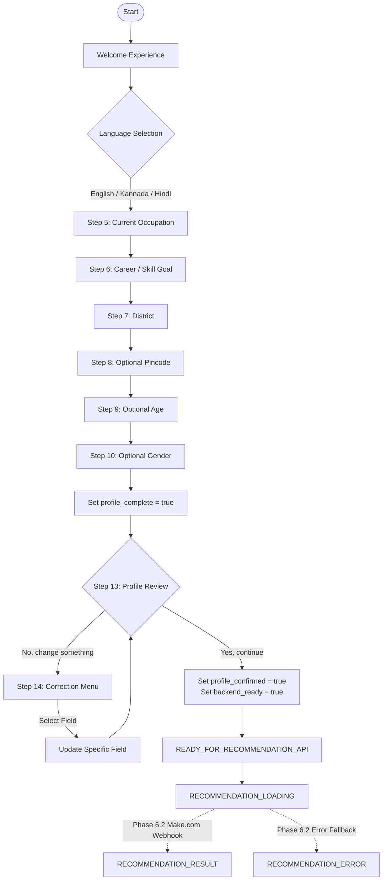

# Voiceflow Conversation Architecture — AI Skill Navigator (Karnataka)

## 1. Overview & Architectural Boundaries

This document defines the complete conversational flow for the worker-facing Voiceflow assistant.

### Strict Architectural Boundaries
- **Voiceflow Scope**:
  1. Greet the worker warmly and respectfully.
  2. Select preferred conversation language (English, Kannada, or Hindi).
  3. Collect worker profile information (current work, career goal, district, optional pincode, age, gender).
  4. Perform basic conversational validation (numeric age, 6-digit pincode, non-empty text).
  5. Present an honest summary of collected information for worker review.
  6. Allow flexible correction if the worker wants to change any field.
  7. Upon confirmation, mark `profile_confirmed = true` and transition to `READY_FOR_RECOMMENDATION_API`.
  8. Display loading, result, and error placeholders for Phase 6.2 Make.com integration.

- **Non-Negotiable Negative Constraints**:
  - Voiceflow **DOES NOT** determine career transitions or skill gaps.
  - Voiceflow **DOES NOT** recommend courses, training centres, or schemes.
  - Voiceflow **DOES NOT** compute distances or travel times.
  - Voiceflow **DOES NOT** evaluate scheme eligibility.
  - Voiceflow **DOES NOT** fabricate GPS coordinates (`latitude` and `longitude` remain `null` unless provided by a genuine device sensor).
  - Voiceflow **DOES NOT** hard-code course catalogues, centre directories, or NSQF levels.
  - All decisions, recommendations, and factual data belong exclusively to the Python/PostGIS backend.

---

## 2. Standardized Variable Dictionary

| Variable | Type | Required? | Default | Description |
|---|---|---|---|---|
| `language` | string | **Yes** | `"English"` | Worker's preferred language (`"English"`, `"Kannada"`, or `"Hindi"`). |
| `occupation` | string | **Yes** | `""` | Free-text description of worker's current trade or daily work. |
| `career_goal_text` | string | **Yes** | `""` | Free-text description of the skill or role the worker wishes to move into. |
| `district` | string | **Yes** | `""` | District name in Karnataka (e.g. `"Bengaluru Urban"`, `"Mysuru"`). |
| `pincode` | string | Optional | `null` | 6-digit postal pincode in Karnataka. |
| `age` | integer | Optional | `null` | Worker's age as an integer (validated 14–80). |
| `gender` | string | Optional | `null` | Gender identification (`"Male"`, `"Female"`, `"Other"`, or `null`). |
| `latitude` | float | Optional | `null` | **Strictly null** unless genuine GPS coordinates are captured. |
| `longitude` | float | Optional | `null` | **Strictly null** unless genuine GPS coordinates are captured. |
| `session_id` | string | Optional | `null` | Session identifier for Make.com / FastAPI correlation. |
| `extra_attributes` | object | Optional | `{}` | Key-value store for extensible metadata. |
| `profile_complete` | boolean | State flag | `false` | Set to `true` once required fields (occupation, goal, district) are provided. |
| `profile_confirmed` | boolean | State flag | `false` | Set to `true` only after worker explicitly reviews and accepts the summary. |
| `backend_ready` | boolean | State flag | `false` | Set to `true` immediately after confirmation, marking API readiness. |

---

## 3. End-to-End Conversation Flow Diagram



---

## 4. Script & Step-by-Step Dialogue Specifications

### Step 3: Welcome Experience
- **English**: *"Namaskara! 👋 I’m your Skill Navigator. I can help you find suitable skill pathways, training courses, nearby training centres, and relevant government schemes. I’ll ask you a few questions about your current work, your goal, and your location. Then I’ll look for suitable options."*
- **Kannada**: *"ನಮಸ್ಕಾರ! 👋 ನಾನು ನಿಮ್ಮ ಸ್ಕಿಲ್ ನ್ಯಾವಿಗೇಟರ್. ಸೂಕ್ತವಾದ ಕೌಶಲ್ಯ ಮಾರ್ಗಗಳು, ತರಬೇತಿ ಕೋರ್ಸ್‌ಗಳು, ಹತ್ತಿರದ ತರಬೇತಿ ಕೇಂದ್ರಗಳು ಮತ್ತು ಸರ್ಕಾರಿ ಯೋಜನೆಗಳನ್ನು ಹುಡುಕಲು ನಾನು ನಿಮಗೆ ಸಹಾಯ ಮಾಡುತ್ತೇನೆ. ನಿಮ್ಮ ಪ್ರಸ್ತುತ ಕೆಲಸ, ನಿಮ್ಮ ಗುರಿ ಮತ್ತು ನಿಮ್ಮ ಸ್ಥಳದ ಬಗ್ಗೆ ನಾನು ಕೆಲವು ಪ್ರಶ್ನೆಗಳನ್ನು ಕೇಳುತ್ತೇನೆ."*
- **Hindi**: *"नमस्कार! 👋 मैं आपका स्किल नेविगेटर हूँ। मैं आपको उपयुक्त कौशल मार्ग, प्रशिक्षण पाठ्यक्रम, नजदीकी प्रशिक्षण केंद्र और प्रासंगिक सरकारी योजनाएं खोजने में मदद कर सकता हूँ। मैं आपके वर्तमान कार्य, आपके लक्ष्य और आपके स्थान के बारे में कुछ प्रश्न पूछूँगा।"*

### Step 4: Language Selection
- **Prompt**: *"What language would you prefer for our conversation? / ನಮ್ಮ ಸಂಭಾಷಣೆಗೆ ನೀವು ಯಾವ ಭಾಷೆಯನ್ನು ಆದ್ಯತೆ ನೀಡುತ್ತೀರಿ? / हमारी बातचीत के लिए आप कौन सी भाषा पसंद करेंगे?"*
- **Buttons / Options**:
  1. `English` → `language = "English"`
  2. `ಕನ್ನಡ (Kannada)` → `language = "Kannada"`
  3. `हिन्दी (Hindi)` → `language = "Hindi"`

### Step 5: Current Occupation
- **Prompt**: *"What work are you currently doing? (For example: Delivery rider, Domestic worker, Construction labourer, Auto driver, Street vendor)"*
- **Variable**: `occupation` (free-text string)
- **Clarification Trigger**: If response is empty or fewer than 2 characters:
  - *"I want to make sure I understood you correctly. What type of work do you currently do?"*

### Step 6: Career / Skill Goal
- **Prompt**: *"What skill or career would you like to move into? (For example: 'I want to become an electrician', 'I want to learn tailoring', 'I want to repair electric vehicles')"*
- **Variable**: `career_goal_text` (free-text string)
- **Note**: Voiceflow captures the exact phrase without attempting to classify or validate against a course list.

### Step 7: District
- **Prompt**: *"Which district in Karnataka are you currently in? (For example: Bengaluru Urban, Mysuru, Belagavi, Kalaburagi)"*
- **Variable**: `district` (free-text string)
- **Clarification Trigger**: If the input is ambiguous:
  - *"Could you please specify your district name in Karnataka?"*
- **Coordinate Rule**: `latitude = null`, `longitude = null`. Never substitute district coordinates.

### Step 8: Optional Pincode
- **Prompt**: *"If you're comfortable sharing it, what is your 6-digit pincode? (You can type your pincode or type 'Skip')"*
- **Variable**: `pincode`
- **Validation**: If entered, check if 6 numeric digits. If invalid:
  - *"Please enter a valid 6-digit pincode, or type 'Skip' to continue."*
- **If Skipped**: `pincode = null`.

### Step 9: Optional Age
- **Prompt**: *"How old are you? (This helps check eligibility for specific youth and welfare schemes. Type your age as a number, or 'Skip')"*
- **Variable**: `age`
- **Validation**: Must be a number between 14 and 80. If invalid:
  - *"Please enter your age as a number between 14 and 80, or type 'Skip'."*
- **If Skipped**: `age = null`.

### Step 10: Optional Gender
- **Prompt**: *"What is your gender? (Certain government welfare schemes offer special support for women or other groups. This is optional.)"*
- **Buttons / Options**:
  1. `Male` → `gender = "Male"`
  2. `Female` → `gender = "Female"`
  3. `Other` → `gender = "Other"`
  4. `Prefer not to say` → `gender = null`

---

## 5. Profile Review & Correction Flow (Steps 13 & 14)

### Step 13: Profile Review
Once all fields have been processed, the system sets `profile_complete = true` and presents:

> **Summary Prompt**:
> *"Let me confirm what you told me:*
> - *Current work: {occupation}*
> - *Career goal: {career_goal_text}*
> - *District: {district}*
> - *Pincode: {pincode or 'Not provided'}*
> - *Age: {age or 'Not provided'}*
> - *Gender: {gender or 'Not provided'}*
>
> *Is this information correct?"*

**Options**:
- `[✅ Yes, continue]` → Set `profile_confirmed = true`, `backend_ready = true` → Transition to `READY_FOR_RECOMMENDATION_API`.
- `[✏️ No, change something]` → Transition to `CORRECTION_MENU`.

### Step 14: Correction Menu
> **Prompt**: *"What would you like to change?"*
- `[1. Current work]` → Re-ask Step 5 → return to Review
- `[2. Career goal]` → Re-ask Step 6 → return to Review
- `[3. District]` → Re-ask Step 7 → return to Review
- `[4. Pincode]` → Re-ask Step 8 → return to Review
- `[5. Age]` → Re-ask Step 9 → return to Review
- `[6. Gender]` → Re-ask Step 10 → return to Review

---

## 6. Integration Boundary & State Transitions (Steps 16 & 17)

### State Sequence:
1. `profile_complete = false`, `profile_confirmed = false`, `backend_ready = false` (Initial intake)
2. `profile_complete = true` (Gathered minimum required fields)
3. `profile_confirmed = true` (Worker clicked "Yes, continue" on review)
4. `backend_ready = true` (Ready for payload dispatch)

### Block: `READY_FOR_RECOMMENDATION_API`
This block represents the clean hand-off point for Phase 6.2 Make.com webhook.
The payload prepared at this state conforms 100% to the backend `WorkerProfileIn` schema:

```json
{
  "occupation": "{occupation}",
  "career_goal_text": "{career_goal_text}",
  "district": "{district}",
  "pincode": "{pincode}",
  "age": "{age}",
  "gender": "{gender}",
  "language": "{language}",
  "latitude": null,
  "longitude": null,
  "session_id": "{session_id}",
  "extra_attributes": {}
}
```

---

## 7. Result & Error Placeholders (Step 21)

- **`RECOMMENDATION_LOADING`**:
  - *"Please wait while I check the available skill pathways, courses, training centres, and relevant schemes..."*
- **`RECOMMENDATION_RESULT`**:
  - Placeholder state awaiting Phase 6.2 Make.com response mapping.
- **`RECOMMENDATION_ERROR`**:
  - *"I’m sorry, I couldn’t retrieve your recommendations right now. Please try again."*
  - Provides a button: `[🔄 Try Again]` returning to `PROFILE_REVIEW`.
